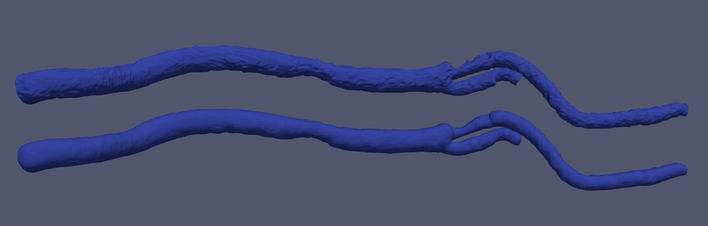

# Vessel Smoothing

A simple CLI tool to smooth vascular surface.

## Usage
Example usage: `./Parent-Vessel-Reconstruction.exe <vessel-surface-path> <centerline-path> <output-surface-path> -s 0.6`

You should first follow https://github.com/jackyko1991/Vessel-Centerline-Extraction to compute centerline from vessel surface file.

Use `-h` command to list detail usage:

```bash
$ ./Vessel-Smoothing.exe -h
Smooth given vessel surface:
  -h [ --help ]                      Displays this help.
  -i [ --input ] arg                 File to process.
  -c [ --centerline ] arg            Centerline file to process.
  -o [ --output ] arg                Output file path.
  -s [ --smooth ] arg (=0.600000024) Voronoi diagram smooth factor between 0
                                     and 1, where 0 indicates minimal smoothing
                                     (default = 0.6)
  -a [ --imageSize ] arg (=90)       PolyBall image size used for marching cube
                                     surface generation, higher is more detail
                                     (default = 90)
```

## Example Data
Sample dataset can be found from ./Data. Corresponding centerlines are included in the same folder. The data is carotid artery with stenosis at CCA/ECA/ICA bifurcation. We would like to perform surface smoothing to remove bulk regions.

```bash
$ ./Vessel-Smoothing.exe -i <project-root>/Data/vessel.stl -c -i <project-root>/Data/centerline.vtp -a 200 -o <project-root>/Data/smooth.stl
```


Top: Before smoothing; Bottom: After smoothing

## Compile from source

We only tested with MSVC 2015 on Windows 10. You have to prepare following dependency first:
- VTK 8.0
- ITK 4.13
- VMTK 1.14
- [Boost > 1.66](https://www.boost.org/)

### CMake Boost Settings
We use [precompiled Boost C++ library](https://boostorg.jfrog.io/artifactory/main/release/1.76.0/source/boost_1_76_0.zip) for convenience.
Uncompress the zipped file to arbitrary directory `<boost-dir>`.

```bash
Boost_INCLUD_DIR := <boost-dir>/boost_1_66_0
Boost_LIBRARY_DIR_RELEASE := D<boost-dir>/boost_1_66_0/lib64-msvc-14
Boost_PROGRAM_OPTIONS_LIBRARY_RELEASE := D<boost-dir>/boost_1_66_0/lib64-msvc-14/boost_program_options-vc140-mt-x64-1_66.lib
```